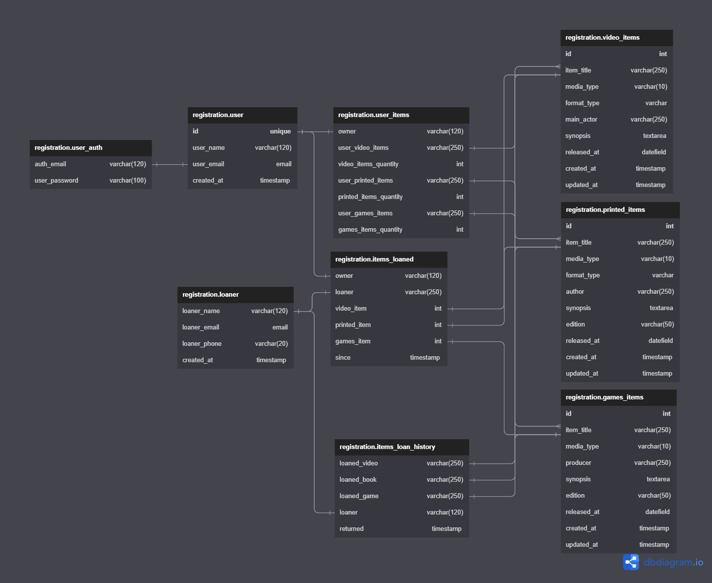

# Items Registration API

This API was made for studies purposes, it allows the creating of a items list which includes digital and printed media such as:
- DVDs
- Blu-ray
- Books
- Comic books
- Games
The main objective is to keep track of which collection objects the person has and if him/her lends those same objects to others persons.
&nbsp

---

## Application Workflow Diagram

 

&nbsp

---

## Entity Relationship Diagram

 

&nbsp

---

## Response List Object

 

&nbsp

---

## Items Registration API - Postman Collection

    <a href="postman/Items Registration API Collection.postman_collection.json">Postman Collection</a>

## License
[MIT](https://choosealicense.com/licenses/mit/)